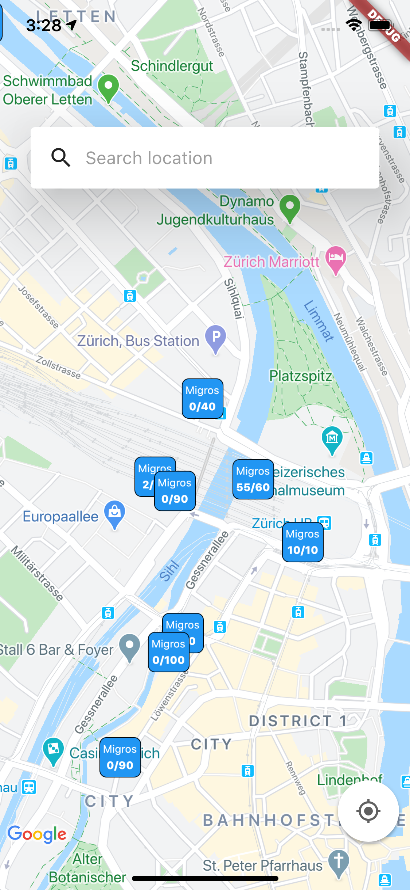
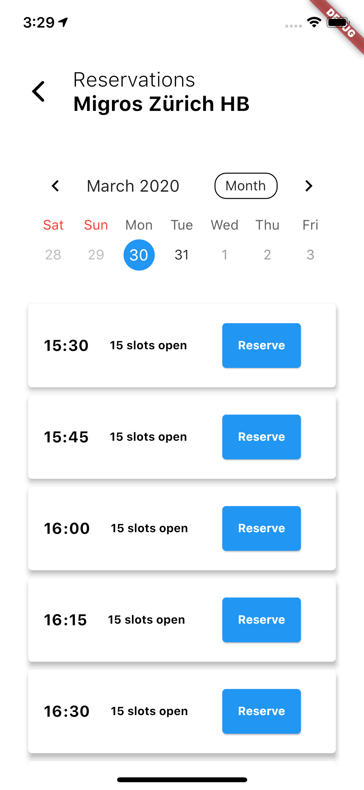
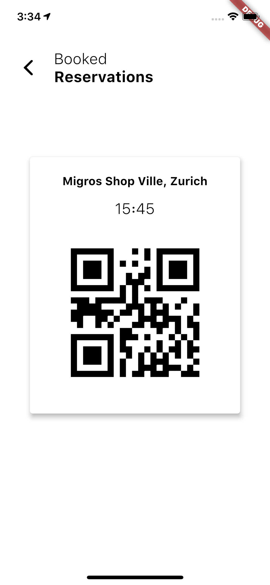
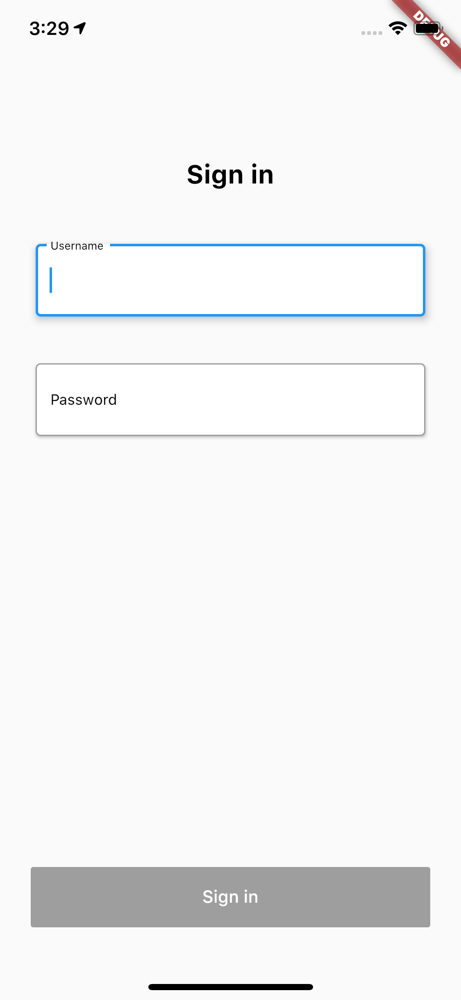
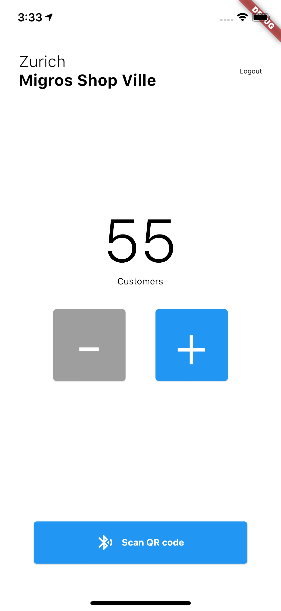

# STO-RES - A Quarantine-Friendly Store Reservation System

This project was created as a part of the ZuriHack "CodeVsCOVID19" hackathon.
<!-- TABLE OF CONTENTS -->
## Table of Contents

* [About the Project](#about-the-project)
  * [A Real-Time View of Store Capacity](#a-real-time-view-of-store-capacity)
  * [A Store Management System](#a-store-management-system)
  * [A Reservation System for Fast Store Access](#a-reservation-system-for-fast-store-access)
* [Technical Details](#technical-details)
  * [Prerequisites](#prerequisites)
  * [Running the App](#running-the-app)
  * [System Info](#system-info)
* [Screenshots](#screenshots)
* [Authors](#authors)

## About The Project
Switzerland is on lockdown. Restaurants, bars, museums, etc. have been closed and all social events have been cancelled. The Swiss Federal Council has imposed strict social distancing rules on the Swiss people and has advised them to stay at home, if possible. Recent data seems to suggest that the people are following this advice.

However, for grocery shopping or getting medical prescriptions from the drug store, people still have to leave their homes. As there are strict regulations on how many people are allowed to be in a room, we often encounter long queues in front of stores like Migros or Coop. In the latter case, people are given a numbered card upon entry that they have to return when leaving the store. This solution is unhygienic and inefficient.

### A Real-Time View of Store Capacity
STO-RES is an app that runs on both iOS and Android smartphones and displays real-time data on stores arround your current or a custom location:
- The maximum number of people allowed in the store.
- The current number of people that are in the store.
- Historic data that show when stores are the most- and least crowded.

From the user's perspective, STO-RES allows him or her to shop more efficiently and avoid people by choosing to shop in the least crowded store. From a higher perspective, STO-RES helps to reduce the risk of transmission of Covid-19 by providing load-balancing across stores for an essential activity where people have to leave their homes.

### A Store Management System
The STO-RES app offers both a customer and a store side. The security personnel at the store entrance can use the app to increase and decrease the people count when people enter and leave the store, respectively, which updates the database in real-time. The app can be operated by multiple security personnel at once in case there are multiple entrances and exits.

This increases efficiency as the database takes care of synchronization accross multiple users and also increases hygiene because it eliminates the need for entry cards that potentially hundreds of people touch over the course of a single day.

### A Reservation System for Fast Store Access
STO-RES additionally offers a reservation system for entry slots. Each store dedicates a percentage of its available entry slots to online reservation. Users can then book a such slot for a store at a designated date and time and be granted direct access by skipping the line. The process is as follows:

1. The user selects a store, a date and a desired entry time on the app.
2. The user makes a confirmation request by pressing the "Book" button.
3. If the reservation is granted, the user receives a QR-code that is stored locally in the app.
4. The user can skip the queue at the store and the security personnel scans the QR code with the app, allowing entry if the check was successful. (INFO: We allow for a +/- 10 minute tolerance with respect to the entry time)

The reservation system allows a user to plan his or her shopping more comfortably as he is guaranteed immediate entry, thus further reducing his or her time away from home.

## Technical Details
### Prerequisites
You will need a working installation of Node.js as well as Flutter. Please follow their instructions of how to set up [here](https://nodejs.org/en/) and [here](https://flutter.dev/docs/get-started/install), respectively.

### Running the App
Open the folder server and frontend. Start the server by runnning `yarn install` and then `yarn start`. The server listens to port 8000 on localhost. Next, start the frontend app by running `flutter run` in the frontend folder. Navigate on the emulator to test the app.

Important: Depending on whether you run the simulator on iOS, you will need to change the server variable of the local server in the file HTTPRequests.dart, i.e 10.0.2.2:8000 for Android and localhost:8000 for iOS.

### System Info
The entire system system consists of multiple entities, of which only the iOS and Android app for both customers are publicly visible, which we introduce shortly

#### iOS and Android App
The app allows customers to see stores around them on a map with their capacity and current utilization, to make reservations for a store and time slot and to skip the queue via a saved QR code, while the app allows multiple security personnel at store entries and exits to enforce the government regulations.
The app is programmed in Dart.

#### Server Backend and API
The public API enables not only our app to gather the relevant information but also offers the possibility for other websites or applications to access it. While some functionality requires authentication (e.g. things that only store security personnel should be able to control) and is therefore not available for the public, other information can be requested through simple GET and POST requests. This would e.g. allow for displaying the current number of customers in a store on the retailers website in realtime, making this important information available for everybody. 

#### Database System
All information is stored in a centralized database system based on MySQL 5.7. This includes data about stores (e.g. geolocation, address, number of people in stores), reservations, security personnel credentials, but also historic store activity data. The database system communicates with the server backend and processes all the requests that the latter receives from the app. It is thus the database that ensures data consistency and integrity. 

## Screenshots
### Customer Side

  

### Store Side

  

## Authors
We are four students that have recently graduated with a BSc. in Computer Science from ETH Zurich and will start our master's degree this fall.
* [Jens Eirik Saethre (@saethrej)](https://linkedin.com/in/saethrej)
* [André Gaillard (@andregail)](https://www.linkedin.com/in/andre-gaillard-811852183/)
* [Livio Schläpfer (@livioschlaepfer)](https://www.linkedin.com/in/livio-schl%C3%A4pfer-b34607179/)
* [Christopher Raffl (@rafflc)](https://www.linkedin.com/in/christopher-raffl-94a2a4180/)

